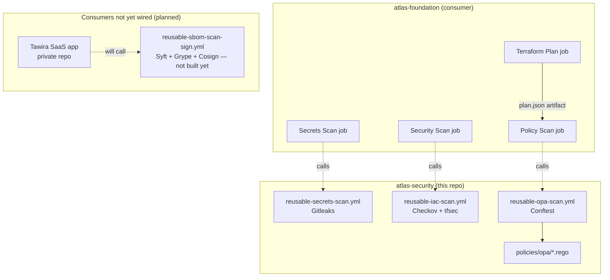

# Atlas Security

> Shared security tooling and policy-as-code for the Atlas platform —
> consumed by every other Atlas repository, not duplicated into each one.

## Problem Statement

Security scanning done independently per-repo drifts: skip-lists
diverge, tool versions diverge, nobody remembers why repo A allows a
finding that repo B blocks. Atlas Security exists to be the single
source of truth for scan policy across every Atlas repository —
reusable GitHub Actions workflows and OPA/Conftest policies that other
repos call by reference, version-pinned, instead of reimplementing.

## Overview

This repo does not scan itself in isolation — its value is proven by
being *consumed*. `atlas-foundation`'s CI calls three of this repo's
reusable workflows on every push (secrets scan, IaC scan, OPA policy
scan), closing the loop from "security tooling exists" to "security
tooling is actually load-bearing infrastructure."

## Objectives

- Reusable GitHub Actions workflows: secrets scanning (Gitleaks), IaC
  scanning (Checkov + tfsec), SBOM generation and vulnerability
  scanning (Syft + Grype), artifact signing (Cosign), SAST (Semgrep)
- OPA/Conftest policies for repo-specific standards not covered by
  off-the-shelf scanners
- A single, versioned skip-list/exception mechanism, ADR-linked, that
  every consuming repo inherits rather than reinvents
- STRIDE threat model and incident runbook for this repo and the
  shared tooling itself
- Prove the platform claim by retrofitting `atlas-foundation` to
  consume it

## Architecture Diagram



## Repository Structure

```text
atlas-security/
├── .github/
│   └── workflows/
│       ├── reusable-secrets-scan.yml
│       ├── reusable-iac-scan.yml
│       ├── reusable-opa-scan.yml
│       ├── reusable-sbom-scan-sign.yml   # planned — see ADR-0001
│       └── reusable-sast.yml              # planned
├── policies/
│   └── opa/
│       ├── tagging.rego
│       └── tagging_test.rego
├── docs/
│   ├── adr/
│   │   └── ADR-0001-use-tawira-instead-of-sample-app.md
│   ├── threat-model.md         # planned
│   └── incident-runbook.md     # planned
├── .editorconfig
├── .gitignore
├── CHANGELOG.md
├── LICENSE
└── README.md
```

`sample-app/` from the original plan is retired — see
[ADR-0001](docs/adr/ADR-0001-use-tawira-instead-of-sample-app.md): the
SBOM/Grype/Cosign pipeline will target Tawira, a real private SaaS
application, once it has a Dockerfile.

## Technology Choices

| Choice | Why this, not the alternative |
|---|---|
| **Gitleaks** over TruffleHog for secrets scanning | Faster on large repos, actively maintained GitHub Action with a straightforward pass/fail signal for CI gating. |
| **Checkov as the hard gate, tfsec as second opinion** | Broader AWS-specific check coverage and SARIF/Actions integration in Checkov; tfsec's independent rule engine catches anything Checkov's ruleset misses, without blocking merges on its own (see `atlas-foundation` ADR-0010). |
| **OPA/Conftest** over Sentinel or custom scripts for policy-as-code | Free/open-source, Rego is purpose-built for structured policy evaluation over JSON (Terraform plan output), and unit-testable via `opa test` — a custom bash script checking tags would not be. |
| **Reusable `workflow_call` workflows** over copy-pasted YAML per repo | Single source of truth: a skip-list or tool-version change made once here propagates to every consuming repo on their next run, rather than needing N repos updated in lockstep. |
| **Tawira over a throwaway sample-app** for SBOM/Grype/Cosign (ADR-0001) | Real, evolving dependency tree produces real, evolving findings — a static sample app's findings would go stale immediately. |

## Deployment Guide

This repo has nothing to "deploy" on its own — its output is
consumed by other repos' CI. A consuming repo wires in a workflow like:

```yaml
security-scan:
  name: Security Scan
  uses: spacecode-art/atlas-security/.github/workflows/reusable-iac-scan.yml@main
  with:
    directory: terraform/
```

Reusable workflows are pinned by ref (`@main` currently; a tagged
release like `@v1` is a natural hardening step once this repo's own
versioning stabilizes).

To run the OPA policy against a Terraform plan locally, before pushing:

```bash
opa test policies/opa/ -v
conftest test <plan.json> --policy policies/opa/ --all-namespaces
```

## CI/CD

This repo's own CI is minimal by design — the workflows it *ships*
are the product, not a build pipeline for itself. `opa test` running
in every consuming repo's CI (transitively, via `reusable-opa-scan.yml`)
is the real ongoing validation of the Rego policies' correctness.

## Current Status

**Live and consumed by `atlas-foundation` today:**
- `reusable-secrets-scan.yml` (Gitleaks) — passing
- `reusable-iac-scan.yml` (Checkov hard gate + tfsec informational,
  `soft_fail: true`, authenticated via `GITHUB_TOKEN`) — passing
- `reusable-opa-scan.yml` (Conftest) running `policies/opa/tagging.rego`
  — passing, and already caught one real finding: 11 resources across
  all three `atlas-foundation` modules were missing `Owner`/`ManagedBy`
  tags before this policy existed (see `atlas-foundation` ADR-0020)

**Not yet built:**
- SBOM + Grype + Cosign pipeline (blocked on Tawira's Dockerfile — ADR-0001)
- Semgrep SAST
- Threat model, incident runbook for this repo itself

## Design Decisions (ADRs)

| ADR | Decision |
|---|---|
| 0001 | Use Tawira (private SaaS repo) instead of a throwaway sample-app |

## Threat Model

Not yet built. Deferred until the SBOM/Grype/Cosign and Semgrep phases
land — a threat model written before this repo's own attack surface
(consuming repos' trust in pinned workflow refs, Rego policy supply
chain) is fully shaped would need a rewrite anyway.

## Security Review

This repo doesn't run Checkov/tfsec against itself (no Terraform
lives here). Its own security-relevant surface is the Rego policies
and workflow YAML, validated by:
- `opa test policies/opa/` — 6/6 unit tests passing
- Every consuming repo's CI run, which is a live integration test of
  these workflows against real Terraform plans

## Testing Strategy

Rego policies are unit-tested with OPA's built-in test framework
(`opa test policies/opa/ -v`), covering: correct detection of missing
tags, correct handling of resources with no tags at all, resources
that already comply, non-taggable resource types being ignored, and
resources being destroyed being ignored (a delete doesn't need an
`Owner` tag on the way out). 6/6 passing as of the tagging policy's
introduction.

## Cost Model

**$0 spent.** Every tool here (Gitleaks, Checkov, tfsec, OPA/Conftest,
and the planned Syft/Grype/Cosign/Semgrep) is free. Both this repo and
`atlas-foundation` are private, so runs draw from GitHub's private-repo
free-tier Actions minutes (2,000/month on the Free plan), not the
unlimited public-repo tier — worth tracking as more workflows and
consumers are added, since that budget is finite and shared across
every repo on the account, unlike the public-repo tier this originally
assumed.

## Monitoring

Not applicable in the traditional sense — this repo produces CI gates,
not running infrastructure. The closest equivalent is each consuming
repo's Actions history, which is the audit trail of every scan run.

## Incident Runbook

Not yet built. First candidate incident type once written: a reusable
workflow reference (`@main`) breaking every consumer simultaneously if
a change here isn't backward compatible — see the Postmortem below for
a related, already-experienced failure mode.

## Postmortem Example

**Incident:** `reusable-iac-scan.yml`'s tfsec step was given a
`soft_fail_commented: true` input intended to make tfsec's own exit
code succeed on findings. The action silently ignored the unrecognized
input (no error, no warning) and continued exiting non-zero, so the
job kept failing even after the "fix" was pushed and merged.

**Detection:** Re-running `atlas-foundation`'s CI after the change
still showed `tfsec (second opinion, non-blocking)` red. The job was
never actually blocking the overall run (`continue-on-error: true`
was masking it correctly), but the red X was misleading and the root
cause was still unresolved.

**Resolution:** Checked tfsec-action's actual documented inputs rather
than assuming the name — the real input is `soft_fail`, not
`soft_fail_commented`. Corrected the input name; the job went green on
the next run.

**Follow-up finding:** Once tfsec's exit-code masking was fixed
correctly, a separate issue surfaced when wiring up OPA: `conftest
test` silently evaluates only the `main` Rego namespace by default. A
policy written as `package terraform.tagging` produced `0 tests, 0
passed` — not an error, just silent non-evaluation — until
`--all-namespaces` was added to the command. Both incidents share a
root cause worth generalizing: **tools that fail silently on
misconfiguration are more dangerous than tools that error loudly**,
because a green (or merely non-crashing) CI run reads as "working"
even when the actual check never ran.

## Future Roadmap

- Capture real evidence from a live CI run against Tawira: SBOM
  output, Grype scan results, Cosign signature/verification — mirror
  `atlas-foundation`'s `docs/evidence/` pattern, currently missing here
- Triage and ADR-document any real CVEs Grype finds in Tawira's image
- SHA/tag pinning for consumers (currently `@main` only — see
  Spoofing/Repudiation in the threat model)
- Tag a versioned release (`@v1`) once the workflow surface stabilizes,
  so consumers can pin to a release instead of tracking `@main` directly
- Enforce the skip-list ADR-citation convention in tooling rather than
  relying on PR review alone (see Elevation of Privilege in the threat
  model)

## Documentation

Architecture decisions are recorded using ADRs in `docs/adr/`.

## Contributing

Please read `CONTRIBUTING.md` before submitting changes.

## License

This project is licensed under the MIT License.